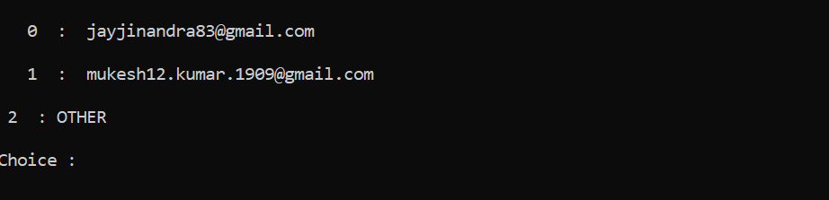

# Automate Your Gmail 
<br>

> **Description** <br><br>
**Using this Program you can send Emails to Multiple users at the same time, also it is possible to send the same mail
multiple times** .
<br><br>

<br><br>

### ***Features***

***

<br>

* This program creates a simple **database** within  users device which stores the Email address of the users ones entered which helps in avoiding writing email adresses every time you run the script.<br><br>


<br>

* You can set the **path** to the database here
    ```python
    path = "Write the path of Database "
    ```

* You can Choose **Multiple Email** addreses at the same time
    ```python
    while(TO!='-1'):
    TO = input("\nEmail TO (enter \'-1\' to exit ): ")
    TOO.append(TO)
    From(TO)

    ```
* The **Multiline Body** is accepted just like actull Email
    ```python
    lines = []
    while True:
        line = input()
        if line:
            lines.append("\n")
            lines.append(line)
        else:
            break

    ```
